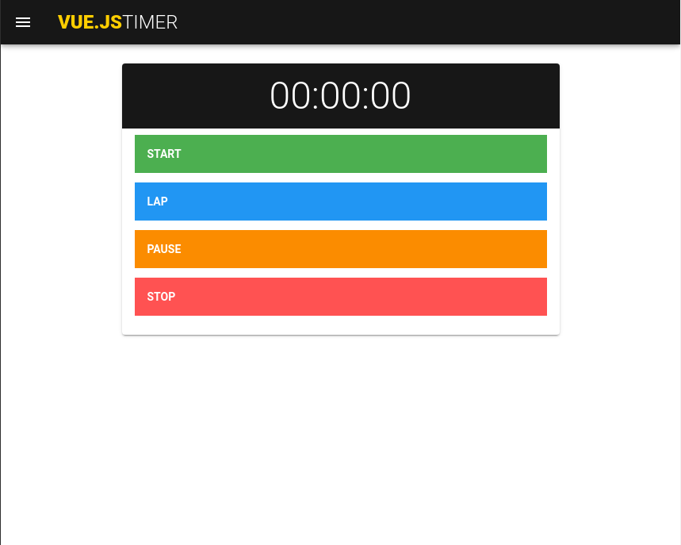

# Timer

## Desenvolvido com

* [Vue.js](https://vuejs.org/)
* [Vuetify](https://vuetifyjs.com/)

## Referência

* [How to code a Timer using Vue - State, Vuetify, Themes, conditionals - Day 34 - #100DaysOfCode - Tyler Potts](https://www.youtube.com/watch?v=bvZyC9HfAOI)

## Screenshot

